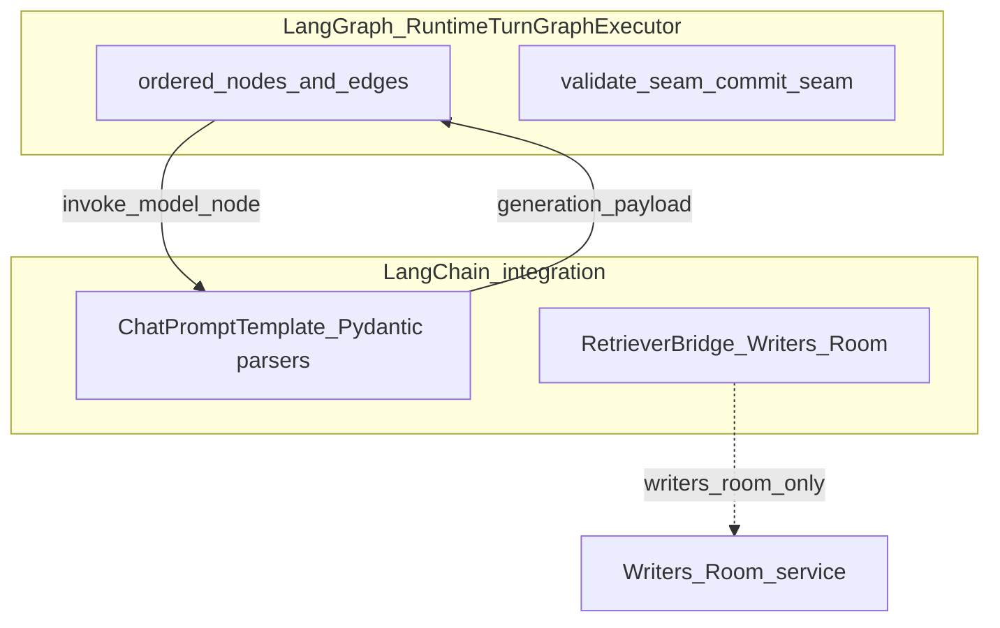

# LangGraph integration

**Model Context Protocol (MCP)** and this page serve different jobs: MCP is the **operator control plane** (stdio tools, resources, prompts). **LangGraph** is the **in-process orchestration library** that orders the **runtime narrative turn** inside `ai_stack` while **world-engine** remains the session authority. See [MCP.md](MCP.md) and [LangChain.md](LangChain.md) for those surfaces.

**Spine:** [AI in World of Shadows — Connected System Reference](../../ai/ai_system_in_world_of_shadows.md).

---

## Plain language

LangGraph answers: **in what order** does a live turn interpret input, pull retrieval context, align to slice YAML, run direction logic, call a model, normalize output, validate, commit, render, and package results? It is a **visible state machine** so operators can see which nodes ran and whether a fallback path was taken.

## Technical precision

- **Implementation:** `ai_stack/langgraph_runtime.py` — class `RuntimeTurnGraphExecutor`, method `_build_graph`.
- **Compiled graph:** a single `StateGraph` over `RuntimeTurnState` (typed dict fields for inputs, retrieval, routing, generation, diagnostics, seam outcomes).
- **Conditional edge:** after `invoke_model`, `_next_step_after_invoke` routes either to `fallback_model` or `proposal_normalize` depending on invocation success and adapter policy.

**Node list (linear backbone, matching `add_edge` order):**

1. `interpret_input` — interpreter output and task hint (`classification` vs `narrative_formulation`).
2. `retrieve_context` — builds a `RetrievalRequest` with `RetrievalDomain.RUNTIME` and profile `runtime_turn_support` (`ai_stack/rag.py`).
3. `goc_resolve_canonical_content` — God of Carnage (GoC) slice YAML resolution path.
4. `director_assess_scene` — scene assessment (director subgraph).
5. `director_select_dramatic_parameters` — dramatic parameters.
6. `route_model` — selects adapter via `story_runtime_core` routing policy inside the graph (not the same executable stack as backend `execute_turn_with_ai`; see [llm-slm-role-stratification.md](../ai/llm-slm-role-stratification.md)).
7. `invoke_model` — structured invocation via LangChain bridge when configured (`invoke_runtime_adapter_with_langchain`).
8. `fallback_model` — optional recovery (often mock) when primary invocation fails.
9. `proposal_normalize` — normalize model proposal payload.
10. `validate_seam` — GoC validation seam (`ai_stack/goc_turn_seams.py`).
11. `commit_seam` — GoC commit seam.
12. `render_visible` — visible bundle for the player-facing layer.
13. `package_output` — final packaging; graph ends at `END`.

**Anchors:** `ai_stack/langgraph_runtime.py` (graph wiring), `ai_stack/runtime_turn_contracts.py` (turn state and health fields), `docs/VERTICAL_SLICE_CONTRACT_GOC.md` (normative GoC checklist).

## Why this matters in World of Shadows

Turn debugging depends on **node-level outcomes**, not only final text. The graph records `nodes_executed`, `node_outcomes`, `fallback_markers`, and execution health (`healthy` | `model_fallback` | `degraded_generation` | `graph_error`) so session diagnostics can answer “which step failed?” without reproducing the full prompt.

## What LangGraph is not

- **Not** the session host: `StoryRuntimeManager` in world-engine increments counters, appends history, runs `resolve_narrative_commit`, and owns persistence after `run()` returns (`world-engine/app/story_runtime/manager.py`).
- **Not** the research pipeline: `ai_stack/research_langgraph.py` sequences research stages in **plain Python**; the filename is historical—the research path does **not** compile a LangGraph `StateGraph` for production orchestration.
- **Not** a durable replay engine by default: checkpoint persistence is explicitly deferred; traces and deterministic fallback take precedence in the current design (verify before assuming checkpoint replay in a given deployment).

## Neighbors

- **LangChain:** prompt templates and parsers **inside** `invoke_model` ([LangChain.md](LangChain.md)).
- **RAG:** `retrieve_context` node only; governance and domains live in `ai_stack/rag.py` ([RAG.md](../ai/RAG.md)).
- **Capabilities:** separate governed operations invoked from backend or tooling, not a replacement for this graph ([capabilities.py](../../../ai_stack/capabilities.py)).

---

## Diagram: runtime turn graph (implementation order)

*Anchored in:* `RuntimeTurnGraphExecutor._build_graph` in `ai_stack/langgraph_runtime.py`.

```mermaid
flowchart LR
  I[interpret_input]
  R[retrieve_context]
  G[goc_resolve_canonical_content]
  D1[director_assess_scene]
  D2[director_select_dramatic_parameters]
  RM[route_model]
  M[invoke_model]
  FB[fallback_model]
  PN[proposal_normalize]
  V[validate_seam]
  C[commit_seam]
  RV[render_visible]
  P[package_output]
  I --> R --> G --> D1 --> D2 --> RM --> M
  M -->|success_or_skip_fallback| PN
  M -->|needs_fallback| FB --> PN
  PN --> V --> C --> RV --> P
```

**What this clarifies:** Model invocation sits **between** routing and seams. Fallback is an **explicit** branch, not a silent retry inside validation.

---

## Diagram: LangGraph vs LangChain in this repository

*Anchored in:* `ai_stack/langgraph_runtime.py` (graph), `ai_stack/langchain_integration/bridges.py` (invoke and retriever bridges).

**What this clarifies:** LangGraph owns **order and branch structure**; LangChain owns **how a single adapter call is templated and parsed**. Writers’ Room additionally uses retriever bridging outside this graph.

---

## Seed graphs (non-runtime)

Minimal **seed** graphs for product experiments—not the canonical play path:

- `build_seed_writers_room_graph()` — Writers’ Room workflow seed.
- `build_seed_improvement_graph()` — improvement workflow seed.

**Anchors:** `ai_stack/langgraph_runtime.py` (functions near file end).

---

## Related

- [LangChain.md](LangChain.md) — structured invocation and bridges.
- [RAG.md](../ai/RAG.md) — retrieval domain, profiles, governance.
- [VERTICAL_SLICE_CONTRACT_GOC.md](../../VERTICAL_SLICE_CONTRACT_GOC.md) — GoC graph checklist.
- [runtime-authority-and-state-flow.md](../runtime/runtime-authority-and-state-flow.md) — who commits session truth.
