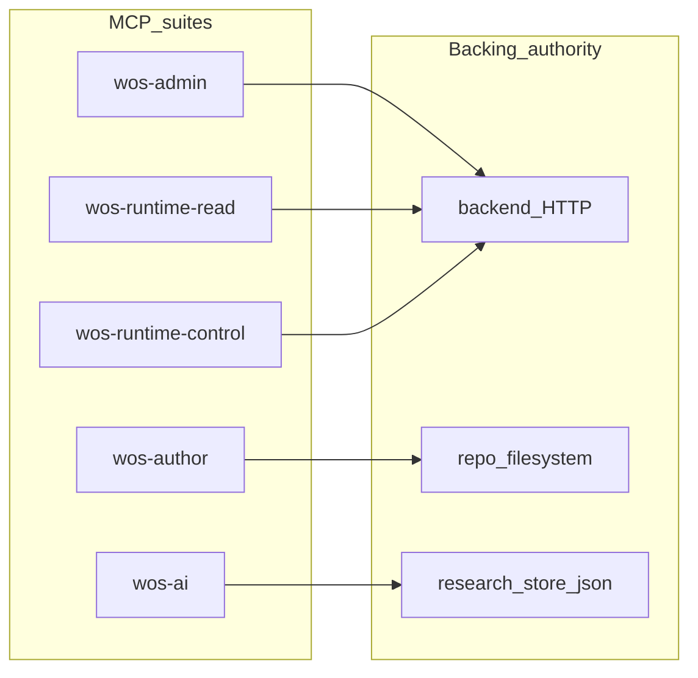
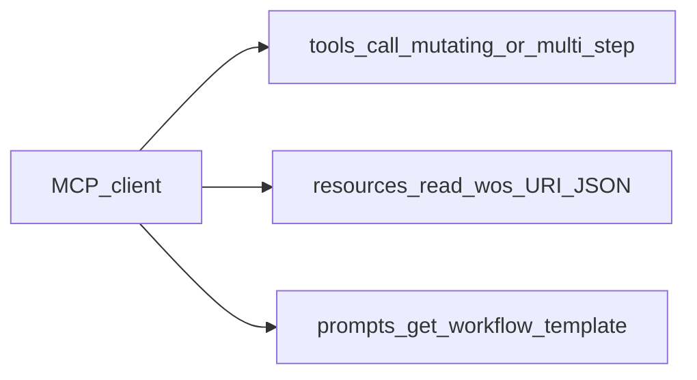
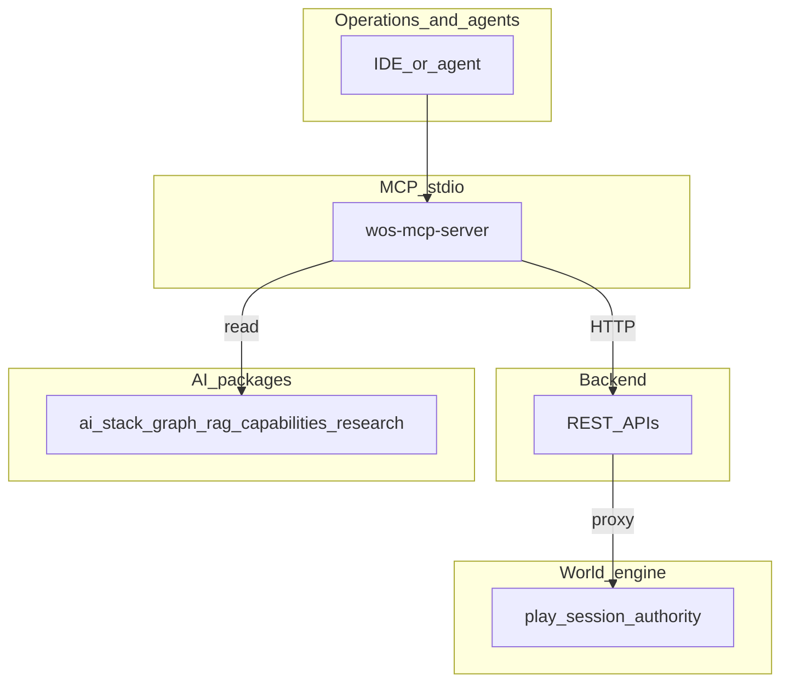

# MCP in World of Shadows (integration reference)

The **Model Context Protocol (MCP)** server in this repository is an **operator and agent control plane**: it exposes a **filtered, typed surface** (tools, resources, prompts) for diagnostics, authoring support, research workflows, and guarded backend calls. It is **not** a second narrative runtime and does **not** bypass world-engine authority for live play.

**Spine:** [AI in World of Shadows — Connected System Reference](../../ai/ai_system_in_world_of_shadows.md).

**Practical suite → tool map:** [MVP_SUITE_MAP.md](../../mcp/MVP_SUITE_MAP.md).

**Contributor setup:** [mcp-server-developer-guide.md](../../dev/tooling/mcp-server-developer-guide.md).

---

## Source of truth (implementation)

| Layer | Location |
|--------|----------|
| Canonical tool descriptors, suites, operator-truth builder | `ai_stack/mcp_canonical_surface.py` |
| Static resource + prompt catalog | `ai_stack/mcp_static_catalog.py` |
| JSON-RPC server (stdio), dispatch, rate limits | `tools/mcp_server/server.py` |
| Tool handlers (backend HTTP, FS, research pipeline) | `tools/mcp_server/tools_registry.py` |
| Resource/prompt resolution (`wos://` URIs) | `tools/mcp_server/resource_prompt_support.py` |
| Backend client | `tools/mcp_server/backend_client.py` |
| Filesystem tools | `tools/mcp_server/fs_tools.py` |

---

## MCP as control plane

### Plain language

Clients (IDEs, agents) connect to **one stdio MCP server** that advertises **what they may call** and **how**. Suites let you run **least-privilege** profiles (for example only read-only session diagnostics, or only research tools).

### Technical terms

- **Tools:** Named JSON-RPC methods with input schemas; handlers perform HTTP calls, filesystem reads, or in-process `ai_stack` work.
- **Resources:** Read-only URIs (`wos://…`) returning JSON text—stable mirrors of the same backing data as tools, without inventing a parallel API shape.
- **Prompts:** Named workflow templates (ordered steps) for agents; bodies live in `resource_prompt_support.py` alongside `MCP_PROMPT_SPECS` in `mcp_static_catalog.py`.
- **Suite filter:** Environment variable `WOS_MCP_SUITE` selects one of `wos-admin`, `wos-author`, `wos-ai`, `wos-runtime-read`, `wos-runtime-control`, or `all` (default). Implemented by `resolve_active_mcp_suite_filter()` in `mcp_canonical_surface.py` and applied in `tools/mcp_server/server.py` when building the registry.

### Why it matters

Operators get **repeatable** access patterns; security reviews can reason about **suite boundaries** instead of ad-hoc scripts.

### What MCP is not

- Not a replacement for `StoryRuntimeManager` or GoC seams.
- Not an invocation path for `CapabilityRegistry.invoke` shortcuts (`mcp_canonical_surface.py` docstring: MCP lists capabilities but does not route around runtime guard/commit).

### Neighbors

- **Capabilities:** `ai_stack/capabilities.py` defines governed operations **inside** backend/graph processes; MCP mirrors catalog rows via `capability_records_for_mcp()` and tool `wos.capabilities.catalog`.
- **Backend:** Session snapshot, diagnostics, logs, health, guarded turn execution—HTTP authority.
- **World-engine:** Reachable **through** backend proxies, not by MCP talking directly to the engine socket in the current design.
- **Research:** `wos-ai` tools call `ai_stack/research_langgraph.py` and `ResearchStore` on disk.

---

## The five MVP suites (code-enumerated)

`McpSuite` in `ai_stack/mcp_canonical_surface.py`:

| Suite id | Responsibility (from descriptors) |
|----------|-------------------------------------|
| `wos-admin` | Health, capability catalog mirror, MCP operator truth aggregate, backend session snapshot |
| `wos-author` | Workspace module listing/read, repository content search (filesystem-backed) |
| `wos-ai` | Research provenance, aspects, claims, runs, exploration graph, bounded explore/validate/bundle, canon issue inspect, canon improvement propose/preview |
| `wos-runtime-read` | Session diagnostics, state, logs (read-only observability) |
| `wos-runtime-control` | Session shell create, guarded `execute_turn` (policy-heavy; not the primary player path) |

**Anchor:** `CANONICAL_MCP_TOOL_DESCRIPTORS` tuple in `mcp_canonical_surface.py` (each tool’s `mcp_suite` field).

### Diagram: suite → authority sources

*Anchored in:* `mcp_canonical_surface.py` (`authority_source` per descriptor: `AUTH_BACKEND_HTTP`, `AUTH_FILESYSTEM_REPO`, `AUTH_AI_STACK_CAPABILITY_CATALOG`, `AUTH_MCP_SURFACE_META`).

---

## Tools vs resources vs prompts

| Mechanism | MCP method | Purpose |
|-----------|------------|---------|
| Tools | `tools/list`, `tools/call` | Side-effecting or multi-step operations; may hit backend, FS, or in-process `ai_stack` (including `run_research_pipeline` in `ai_stack/research_langgraph.py`) |
| Resources | `resources/list`, `resources/read` | Read-only JSON mirrors; URI templates in `MCP_RESOURCE_SPECS` |
| Prompts | `prompts/list`, `prompts/get` | Suggested step order for common operator workflows (`MCP_PROMPT_SPECS` in `ai_stack/mcp_static_catalog.py`, bodies in `tools/mcp_server/resource_prompt_support.py`) |

### Diagram: three MCP mechanism classes

*Anchored in:* JSON-RPC handlers in `tools/mcp_server/server.py` (`initialize`, `tools/call`, `resources/read`, `prompts/get`).

**What this clarifies:** **Tools** execute work; **resources** are stable read mirrors; **prompts** are **guidance** for agents, not hidden tools.

### Research tools vs RAG

**Research** MCP tools (`wos-ai` suite) read and write the **research JSON store** under `.wos/research/` via `ResearchStore` (`ai_stack/research_store.py`). **RAG** uses a **separate** on-disk corpus under `.wos/rag/` (`ai_stack/rag.py`). Both can inform models; neither is live session authority. When future callers retrieve for research-shaped work, `RetrievalDomain.RESEARCH` / profile `research_eval` is defined in `rag.py` ([RAG.md](../ai/RAG.md)).

**Operating profile:** `WOS_MCP_OPERATING_PROFILE` (`healthy`, `review_safe`, `test_isolated`, `degraded`) gates **write-capable** tools (`McpToolClass.write_capable`) in `server.py` via `operating_profile_allows_write_capable`.

**Tool classes:** `read_only`, `review_bound`, `write_capable` — each canonical tool carries `tool_class` and `narrative_mutation_risk` metadata for governance views (`McpCanonicalToolDescriptor`).

---

## Capability layer relationship (still valid, narrower than the whole MCP)

`ai_stack/capabilities.py` registers **named capabilities** with:

- JSON schemas, allowed **modes** (`runtime`, `writers_room`, `improvement`, `admin`)
- **Kind** (`retrieval` vs `action`)
- Audit and denial semantics

**Where this still shows up:**

- Runtime graph and Writers’ Room / improvement workflows **invoke** capabilities in-process.
- MCP exposes **`wos.capabilities.catalog`** as a **read-only mirror** enriched by `capability_records_for_mcp()` (`mcp_canonical_surface.py`).
- Research exploration is both a **capability** (`wos.research.explore`) and a set of **MCP tools** under `wos-ai`; MCP adds transport and suite scoping; the capability system adds mode/audit semantics inside services.

**What changed from early “MCP = capabilities only” wording:** The implemented server is **broader**: filesystem tools, backend session tools, static resources, prompts, suite filters, and `wos.mcp.operator_truth` aggregates—see `CANONICAL_MCP_TOOL_DESCRIPTORS`.

---

## How MCP relates to backend, world-engine, AI, and operations

*Anchors:* `tools/mcp_server/backend_client.py` (backend), `world-engine` play host called via backend game service patterns, `ai_stack` for research tools.

**Not a second runtime:** Narrative commit semantics remain in world-engine + GoC contracts. MCP may trigger **guarded** `execute_turn` through backend policy (`wos.session.execute_turn` descriptor marks `narrative_mutation_risk` / internal-only posture)—treat as **exceptional operator path**, not the player default.

---

## Operator truth aggregate

`wos.mcp.operator_truth` and resource `wos://mcp/operator_truth` return `build_compact_mcp_operator_truth(...)` — compact JSON describing catalog alignment, implemented vs deferred tools, operating profile, and “no eligible” style discipline for the **MCP surface itself**. This is **legibility**, not runtime narrative truth.

**Anchor:** `build_compact_mcp_operator_truth` in `mcp_canonical_surface.py`.

---

## Related

- [MVP_SUITE_MAP.md](../../mcp/MVP_SUITE_MAP.md)
- [MCP scope baseline](../../mcp/00_M0_scope.md) — foundational safety posture (read vs write expectations)
- [capabilities.py](../../../ai_stack/capabilities.py) — in-repo capability definitions
