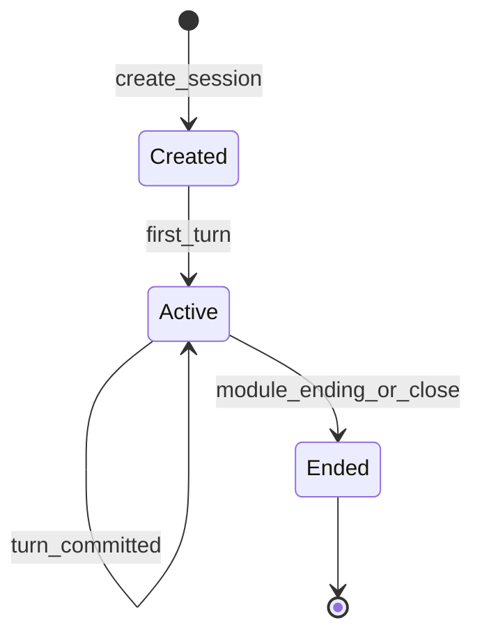

# Runtime authority and state flow

**Who owns live play** and how **session state** progresses through turns. This is the consolidated technical source for the former `docs/architecture/runtime_authority_decision.md` and the developer-oriented session overview.

## Decision summary

- **World-engine** is the **authoritative runtime host** for story sessions (create, execute turn, state, diagnostics).
- **Backend** is the **policy, review, publishing, and governance** layer (and platform persistence for non-runtime data).
- **Shared core** (`story_runtime_core`) holds **model/adapter contracts**, registry/routing, and reusable interpretation behavior.

## Ownership matrix

| Layer | Owns |
|-------|------|
| **Play service (`world-engine`)** | Story session lifecycle, authoritative turn execution, runtime-side session persistence model |
| **Backend** | Auth, platform policy, content compilation/publishing governance, admin APIs, integration/proxy to play |
| **`story_runtime_core`** | Shared interpretation, registry/adapters, reusable runtime models |
| **`ai_stack`** | Turn graph execution, RAG, LangChain adapters, capabilities — **proposals** until validated/committed |

## Invariant

**AI output is not committed narrative truth** until validation and commit rules allow it. For God of Carnage, the binding turn contract is [`docs/MVPs/MVP_VSL_And_GoC_Contracts/CANONICAL_TURN_CONTRACT_GOC.md`](../../MVPs/MVP_VSL_And_GoC_Contracts/CANONICAL_TURN_CONTRACT_GOC.md).

## Code anchor (first read)

`world-engine/app/story_runtime/manager.py` — `StoryRuntimeManager`:

- Holds in-memory `StorySession` objects (`session_id`, `module_id`, `runtime_projection`, history, diagnostics, narrative threads).
- Builds default retriever and context assembler via `ai_stack` (`build_runtime_retriever`).
- Constructs `RuntimeTurnGraphExecutor` with `interpret_player_input` from `story_runtime_core`, routing, registry, adapters, retriever, capability registry, and repo root.

## Session lifecycle (conceptual)

Exact transitions depend on module endings and HTTP/WebSocket handlers under `world-engine/app/`.

## Backend integration

The backend calls the play service using `PLAY_SERVICE_*` environment variables (see root `docker-compose.yml` and [`docs/dev/local-development-and-test-workflow.md`](../../dev/local-development-and-test-workflow.md)). Do not duplicate runtime business logic in the backend without an ADR.

## Backend volatile session registry (transitional)

For **in-process** operator/MCP/test flows, the backend keeps a **process-local**, **non-durable** map `session_id → RuntimeSession` in [`backend/app/runtime/session_store.py`](../../../backend/app/runtime/session_store.py). It is **not** the World Engine session authority; entries vanish on process restart.

- **API:** Use `create_session`, `get_session`, `update_session`, `delete_session`, or the `RuntimeSessionRegistry` accessor `get_runtime_session_registry()` — do not rely on a raw module-level dict.
- **Concurrency:** The registry is an ordinary in-memory dict without locking; assume single-threaded use per worker consistent with typical Flask request handling unless you add external synchronization.
- **Lifecycle:** Matches the backend process; `clear_registry()` exists for tests.

## Related

- [`world_engine_authoritative_runtime_and_system_interactions.md`](world_engine_authoritative_runtime_and_system_interactions.md) — canonical World Engine spine (two play-service faces, integration, diagrams)
- [`player_input_interpretation_contract.md`](player_input_interpretation_contract.md) — structured interpretation contract
- [`world_engine_authoritative_narrative_commit.md`](world_engine_authoritative_narrative_commit.md) — commit semantics
- [`../integration/LangGraph.md`](../integration/LangGraph.md) — turn graph orchestration
- [`../ai/RAG.md`](../ai/RAG.md) — retrieval in the turn path
- ADR: [`docs/governance/adr-0001-runtime-authority-in-world-engine.md`](../../governance/adr-0001-runtime-authority-in-world-engine.md)
