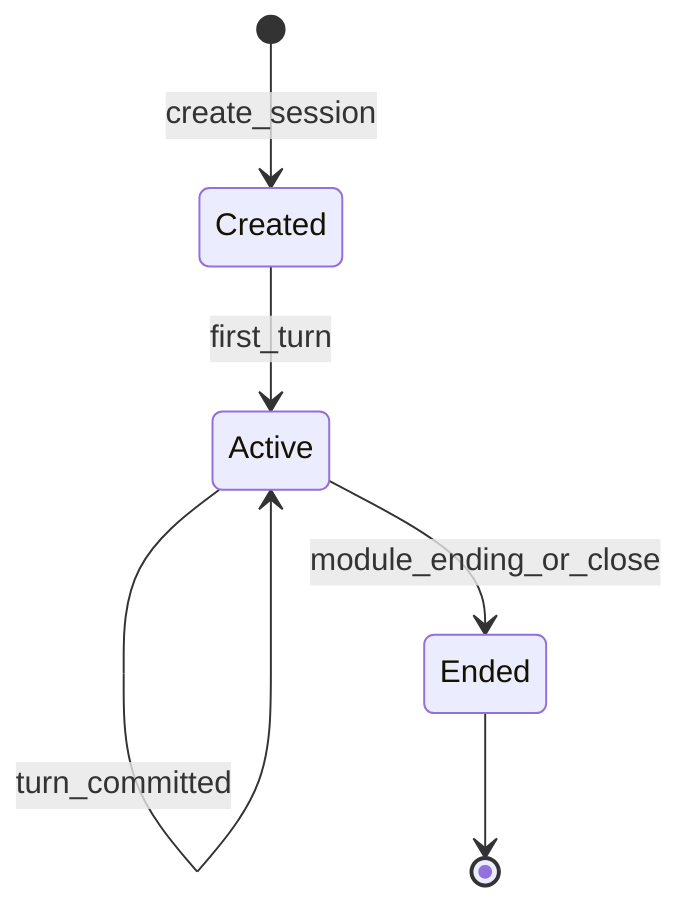

# Runtime authority and state flow
**Migrated Decision:** See canonical ADR: [ADR-0001: Runtime authority in world-engine](../../ADR/adr-0001-runtime-authority-in-world-engine.md)

**Who owns live play** and how **session state** progresses through turns. This is the consolidated technical source for the former `docs/architecture/runtime_authority_decision.md` and the developer-oriented session overview.

Ownership matrix

| Layer | Owns |
|-------|------|
| **Play service (`world-engine`)** | Story session lifecycle, authoritative turn execution, runtime-side session persistence model |
| **Backend** | Auth, platform policy, content compilation/publishing governance, admin APIs, integration/proxy to play |
| **`story_runtime_core`** | Shared interpretation, registry/adapters, reusable runtime models |
| **`ai_stack`** | Turn graph execution, RAG, LangChain adapters, capabilities — **proposals** until validated/committed |

## Invariant

**AI output is not committed narrative truth** until validation and commit rules allow it. For God of Carnage, the binding turn contract is [`docs/MVPs/MVP_VSL_And_GoC_Contracts/CANONICAL_TURN_CONTRACT_GOC.md`](../../MVPs/MVP_VSL_And_GoC_Contracts/CANONICAL_TURN_CONTRACT_GOC.md).

Agency preservation is enforced at two levels:

- Actor-lane and authority validation reject AI output that speaks, acts, emotes, decides for, or coerces the selected human actor. Structured NPC coercion of the human actor is recorded as `npc_action_controls_human_actor`, mapped to `npc.force_player_speech.forbidden`, and blocked before commit.
- Protected identity and canonical truth deltas are proposal data only. `candidate_deltas` must pass the `StateDeltaBoundary` check in `run_commit_seam`; rejected deltas produce `state_delta_rejection` and no committed story truth.

## Code anchor (first read)

`world-engine/app/story_runtime/manager/` — `StoryRuntimeManager`:

- Holds in-memory `StorySession` objects (`session_id`, `module_id`, `runtime_projection`, history, diagnostics, narrative threads, policy-driven hierarchical memory snapshot).
- Builds default retriever and context assembler via `ai_stack` (`build_runtime_retriever`).
- Constructs `RuntimeTurnGraphExecutor` with `interpret_player_input` from `story_runtime_core`, routing, registry, adapters, retriever, capability registry, and repo root.
- Loads `ModuleRuntimePolicy.runtime_governance_policy` so action-resolution short paths, visible-projection hard-failure behavior, capability gates, and continuity hooks come from module content instead of module-name branches in generic runtime code.
- Persists `turn_aspect_ledger` with the canonical turn record so selected beat, capability, narrator/NPC/player authority, structured NPC coercion rejection, visible origin evidence, validation, and commit status can be inspected without frontend inference.
- Forwards `candidate_deltas` and `state_delta_boundary` into the commit seam. Protected-path rejections stay explicit in `committed_result.state_delta_rejection` and `turn_aspect_ledger.commit`.
- Loads `ModuleRuntimePolicy.memory_policy`, writes bounded hierarchical memory only from canonical committed turns, and projects safe memory context into LangGraph. This is session-local runtime continuity, not a second source of truth.
- Rebuilds the bounded callback web from committed-truth rows after commits, persists `callback_web_record.v1`, projects `callback_web_feedback.v1` into the next graph turn, and records `turn_aspect_ledger.callback_web` without mutating canonical story state. Recoverable/false-commit rows remain audit history and are filtered before callback feedback construction.
- Rebuilds the bounded consequence cascade from committed-truth rows after commits, persists `consequence_cascade_record.v1`, projects `consequence_cascade_feedback.v1` into the next graph turn, and records `turn_aspect_ledger.consequence_cascade` without using generated prose or branch previews as oracles. Recoverable/false-commit rows remain audit history and are filtered before cascade feedback construction.
- Builds `no_dead_end_recovery.v1` for player-visible committed and recoverable turns, records `turn_aspect_ledger.no_dead_end_recovery`, and keeps recovery commit policy explicit so playable fallbacks cannot become false story truth.
- Derives `pacing_rhythm_state` / `pacing_rhythm_target`, validates structured cadence realization, persists planner-truth rhythm feedback, and records `turn_aspect_ledger.pacing_rhythm` without using generated prose as an oracle.
- Derives `temporal_control_state` / `temporal_control_target`, validates structured temporal-control events against selected operations and committed refs, persists planner-truth feedback, and records `turn_aspect_ledger.temporal_control` without using chronology prose as an oracle.
- Derives `expectation_variation_state` / `expectation_variation_target`, validates structured expectation-variation events against selected ids, setup refs, budget, and cooldown, persists planner-truth feedback, and records `turn_aspect_ledger.expectation_variation` without using generated surprise prose as an oracle.
- Derives `narrative_momentum_state` / `narrative_momentum_target`, validates structured momentum events against allowed state transitions, progress requirements, velocity bounds, stall budget, and source refs, persists planner-truth feedback, and records `turn_aspect_ledger.narrative_momentum` without using generated dramatic prose as an oracle.
- Derives `symbolic_object_resonance_state` / `symbolic_object_resonance_target`, validates structured symbolic-object events against selected canonical object ids, symbol ids, roles, source refs, and budget, persists planner-truth feedback, and records `turn_aspect_ledger.symbolic_object_resonance` without using generated symbolic prose as an oracle.

## Session lifecycle (conceptual)

Exact transitions depend on module endings and HTTP/WebSocket handlers under `world-engine/app/`.

## Backend integration

The backend calls the play service using `PLAY_SERVICE_*` environment variables (see root `docker-compose.yml` and [`docs/dev/local-development-and-test-workflow.md`](../../dev/local-development-and-test-workflow.md)). Do not duplicate runtime business logic in the backend without an ADR.

## Backend volatile session registry (transitional)

For **in-process** operator/MCP/test flows, the backend keeps a **process-local**, **non-durable** map `session_id → RuntimeSession` in [`backend/app/runtime/session/session_store.py`](../../../backend/app/runtime/session/session_store.py). It is **not** the World Engine session authority; entries vanish on process restart.

- **API:** Use `create_session`, `get_session`, `update_session`, `delete_session`, or the `RuntimeSessionRegistry` accessor `get_runtime_session_registry()` — do not rely on a raw module-level dict.
- **Concurrency:** The registry is an ordinary in-memory dict without locking; assume single-threaded use per worker consistent with typical Flask request handling unless you add external synchronization.
- **Lifecycle:** Matches the backend process; `clear_registry()` exists for tests.

## Related

- [`docs/ADR/README.md`](../../ADR/README.md) — Architecture Decision Records (ADR) index
- [`world_engine_authoritative_runtime_and_system_interactions.md`](world_engine_authoritative_runtime_and_system_interactions.md) — canonical World Engine spine (two play-service faces, integration, diagrams)
- [`player_input_interpretation_contract.md`](player_input_interpretation_contract.md) — structured interpretation contract
- [`callback_web_contract.md`](callback_web_contract.md) — bounded Pi17 callback web index and operator evidence
- [`pacing_rhythm_contract.md`](pacing_rhythm_contract.md) — bounded Pi18 pacing-rhythm cadence contract and structured validation
- [`consequence_cascade_contract.md`](consequence_cascade_contract.md) — bounded Pi21 consequence cascade over committed truth and branch selections
- [`sensory_context_contract.md`](sensory_context_contract.md) — bounded Pi26 sensory-context layer selection and structured validation
- [`temporal_control_contract.md`](temporal_control_contract.md) — bounded Pi28 temporal-control operation selection and structured validation
- [`improvisational_coherence_contract.md`](improvisational_coherence_contract.md) — bounded Pi24 structured acceptance contract and runtime-aspect diagnostics
- [`expectation_variation_contract.md`](expectation_variation_contract.md) — bounded Pi29 surprise-budget contract through selected expectation variation, setup refs, cooldown, and structured validation
- [`narrative_momentum_contract.md`](narrative_momentum_contract.md) — bounded Pi31 narrative-momentum state machine, transition/progress/stall validation, and structured runtime evidence
- [`genre_awareness_contract.md`](genre_awareness_contract.md) — bounded Pi32 genre-awareness contract through module-authored profile, registers, conventions, marker blocks, and structured validation
- [`symbolic_object_resonance_contract.md`](symbolic_object_resonance_contract.md) — bounded Pi33 symbolic-object contract through canonical object ids, resonance roles, source refs, and structured validation
- [`meta_narrative_awareness_contract.md`](meta_narrative_awareness_contract.md) — bounded Pi25 opt-in meta-narrative awareness v1/v2 contract, fourth-wall scope, selected-memory-ref validation, and structured validation
- [`world_engine_authoritative_narrative_commit.md`](world_engine_authoritative_narrative_commit.md) — commit semantics
- [`../integration/LangGraph.md`](../integration/LangGraph.md) — turn graph orchestration
- [`../ai/RAG.md`](../ai/RAG.md) — retrieval in the turn path
- ADR: [`docs/ADR/adr-0001-runtime-authority-in-world-engine.md`](../../ADR/adr-0001-runtime-authority-in-world-engine.md)
