# World Engine: Authoritative Runtime and System Interactions

Canonical reference for the **World of Shadows play service** (`world-engine/`): what it is in isolation, what it **commits** as runtime truth, and how it sits at the center of backend integration, player flows, AI, MCP, authored content, and operations.

**Repository anchors:** [`adr-0001-runtime-authority-in-world-engine.md`](../../governance/adr-0001-runtime-authority-in-world-engine.md), `world-engine/app/main.py`.

## Purpose and how to use this document

This page is the **spine** for runtime documentation. It connects implementation seams to contracts elsewhere in the repo. For deeper, topic-focused pages, cross-link to:

- [Runtime authority and state flow](runtime-authority-and-state-flow.md) — ownership matrix and first code read
- [World-Engine authoritative narrative commit](world_engine_authoritative_narrative_commit.md) — scene commit semantics (God of Carnage)
- [Player input interpretation contract](player_input_interpretation_contract.md) — structured interpretation shape
- [A1 repair — free input as primary path](a1_free_input_primary_runtime_path.md) — end-to-end player turn path via backend proxy
- [Backend runtime classification](../architecture/backend-runtime-classification.md) — what must **not** run inside Flask as live play
- [Architecture overview](../architecture/architecture-overview.md) — service map
- [ADR-0001: Runtime authority in world-engine](../../governance/adr-0001-runtime-authority-in-world-engine.md)
- [How AI fits the platform](../../start-here/how-ai-fits-the-platform.md) and [AI stack overview](../ai/ai-stack-overview.md)
- [Canonical turn contract (GoC)](../../CANONICAL_TURN_CONTRACT_GOC.md)
- [M0 MCP host and runtime](../../mcp/01_M0_host_and_runtime.md)

## Scope and source of truth

**Priority:** (1) repository implementation, (2) existing docs and ADRs, (3) tests and reports, (4) governance artifacts, (5) clearly labeled **inference** only where the code does not name a concern explicitly.

**Repository anchors for scope:** `world-engine/app/main.py` mounts both the HTTP API (`app/api/http.py`) and WebSocket runtime (`app/api/ws.py`), and constructs both `RuntimeManager` and `StoryRuntimeManager` in the FastAPI lifespan.

**Important:** The play service hosts **two cooperating runtime surfaces** (see §5). Treating them as one undifferentiated “box” loses accuracy. This document names both and explains shared authority rules.

---

## Executive overview

**Plain language.** When a story is “live,” something has to own **what actually happened** in the session—current scene, turn count, committed consequences—not just what a model suggested or what a database row says for marketing. In World of Shadows, that **live session authority** lives primarily in the **play service** (`world-engine/`). Other parts of the system propose, compile, govern, or display—but the engine **validates and commits** what counts for play, under contracts like the GoC turn rules.

**Technical precision.** The FastAPI app in `world-engine/` exposes:

1. **Template / lobby / run runtime** — `RuntimeManager` + `RuntimeEngine` (`world-engine/app/runtime/manager.py`, `world-engine/app/runtime/engine.py`): nested runs, snapshots, transcripts, WebSocket command processing after ticket verification (`world-engine/app/api/ws.py`).
2. **Story narrative runtime** — `StoryRuntimeManager` (`world-engine/app/story_runtime/manager.py`): in-memory `StorySession` map, `execute_turn` orchestration via `ai_stack.RuntimeTurnGraphExecutor`, narrative commit resolution (`world-engine/app/story_runtime/commit_models.py`), state and diagnostics HTTP endpoints under `/api/story/...` (`world-engine/app/api/http.py`).

**Why this matters in World of Shadows.** Without a single authoritative host, you get duplicate turn logic, divergent session state between Flask and FastAPI, and “AI said it, so it must be true” failures. ADR-0001 and backend classification docs exist precisely to prevent that drift.

**Adjacent systems.** Backend proxies story operations through `backend/app/services/game_service.py` to internal play URLs (`PLAY_SERVICE_INTERNAL_URL`). Frontend play shell hits Flask first for the path documented in `a1_free_input_primary_runtime_path.md`.

**Repository anchors:** `world-engine/app/main.py`, `world-engine/README.md`.

**What the World Engine does not own.** Long-term platform identity, billing, forum/wiki, canonical YAML authoring workflows, or admin-only governance UIs—these live in `backend/` and `administration-tool/`. The engine also does not replace **authored source truth** in `content/modules/`; it consumes compiled projections and feeds.

---

## The World Engine in one sentence

The **World Engine** is the **FastAPI play service** (`world-engine/`) that hosts **authoritative live runtime state** for template runs (HTTP/WebSocket) and **authoritative story sessions** (HTTP story API), where **AI and interpreters produce proposals and context** until **runtime rules** select and **commit** what becomes session truth—most visibly as **narrative commit records** for scene progression in the story path. **Anchors:** `world-engine/app/main.py` (dual managers + routers), `world-engine/app/story_runtime/manager.py` (`StoryRuntimeManager.execute_turn`).

---

## The Heart of the Running World — two faces of the play service

### Plain language

Think of the play service as a building with **two rooms**: one for **group template runs** (lobbies, tickets, real-time sockets) and one for **guided narrative sessions** (turns, AI graph, explicit “what scene are we in now?” commits). Both are “the engine,” but they answer different player questions.

### Technical precision

| Face | Primary modules | Entry transport | Authoritative objects |
|------|-----------------|-----------------|------------------------|
| **Run / lobby runtime** | `world-engine/app/runtime/*`, tickets `world-engine/app/auth/tickets.py` | REST under `/api/runs`, `/api/tickets`, `/ws` | `RuntimeInstance`, participants, transcript, snapshots via `RuntimeEngine.build_snapshot` |
| **Story runtime** | `world-engine/app/story_runtime/*` | REST under `/api/story/sessions` (internal API key) | `StorySession` (`session_id`, `module_id`, `runtime_projection`, `current_scene_id`, `history`, `diagnostics`, narrative threads) |

**Shared process:** `world-engine/app/main.py` initializes both managers on startup; trace middleware (`world-engine/app/middleware/trace_middleware.py`) can correlate requests.

**Inference.** The repo does not always use a single product name for “face 1” vs “face 2”; “World Engine” and “play service” are used interchangeably in docs. This document uses **play service** for the process and **story runtime** / **run runtime** for the two faces.

### Why this matters in World of Shadows

Operators debugging “wrong scene” must know whether they are in **story session** commit logic or **template run** command routing—different code paths, different contracts.

### How it connects to adjacent subsystems

- Backend integrates with **both** via `game_service` (runs, tickets, transcripts, terminate) and story session HTTP (`create_story_session`, `execute_story_turn`, etc.).
- AI stack is on the **critical path** for story turns (`StoryRuntimeManager` construction in `manager.py`); run-time WebSocket commands use `RuntimeManager.process_command` without the LangGraph executor in the same way.

### What the World Engine explicitly does not own

It does not **author** canonical YAML modules; it does not **publish** content to production governance queues; it does not **authenticate end users** for the player site (backend JWT/session domain).

**Repository anchors:** `world-engine/app/main.py`, `world-engine/app/runtime/manager.py`, `world-engine/app/story_runtime/manager.py`, `world-engine/README.md`.

---

### Diagram 1 — System context: World Engine in World of Shadows

**Title:** Play service in the multi-service narrative platform.

**What it shows:** Surrounding services and data ownership at a high level.

**Why it matters:** Anchors vocabulary (player UI vs admin vs backend vs play service) to the same layout as [`architecture-overview.md`](../architecture/architecture-overview.md) and root [`docker-compose.yml`](../../../docker-compose.yml).

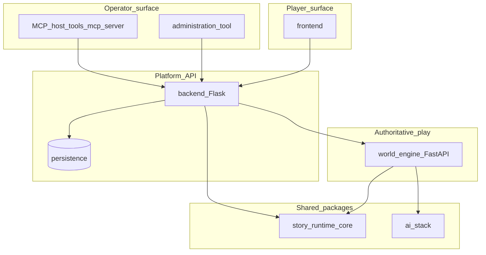

**What to notice.** Player and admin UIs talk to **backend** first; **live play** executes in **world-engine**. MCP (Phase A) is an **operator** path to backend, not a second runtime inside the turn loop ([`01_M0_host_and_runtime.md`](../../mcp/01_M0_host_and_runtime.md)).

**Seams:** `docker-compose.yml` (`play-service`, `backend`, `frontend`), `backend/app/services/game_service.py`.

---

### Diagram 2 — World Engine in isolation: internal responsibility zones

**Title:** Components inside the `world-engine` package.

**What it shows:** How API layers bind to the two managers and shared libraries.

**Why it matters:** Prevents conflating WebSocket run hosting with story session commits.

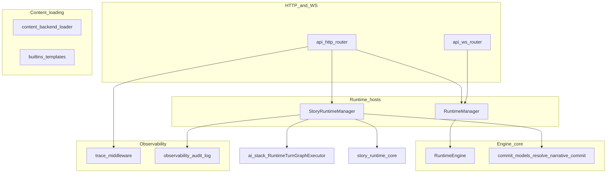

**What to notice.** **Story** path pulls in `ai_stack` and `story_runtime_core` at construction time (`StoryRuntimeManager.__init__` in `world-engine/app/story_runtime/manager.py`). **Run** path centers on `RuntimeEngine` and store configuration (`world-engine/app/runtime/store.py`, `world-engine/app/config.py`).

**Seams:** `world-engine/app/main.py`, `world-engine/app/api/http.py`, `world-engine/app/api/ws.py`.

---

## The Engine That Gets to Say What Is True — runtime authority

### Plain language

“Authority” means: **if two layers disagree, the engine’s committed record wins** for live play—subject to contracts. A model’s favorite scene change does not count until it passes the same checks as a typed travel command.

### Technical precision

For **story runtime**, `resolve_narrative_commit` (`world-engine/app/story_runtime/commit_models.py`) builds a `StoryNarrativeCommitRecord`: prior scene, proposed scene, **committed** scene, `situation_status`, `commit_reason_code`, candidate provenance (`explicit_command` vs `model_structured_output` vs `player_input_token_scan`), and bounded consequence tokens. `StoryRuntimeManager.execute_turn` applies `committed_scene_id` to the session **after** graph execution ([`world_engine_authoritative_narrative_commit.md`](world_engine_authoritative_narrative_commit.md)).

**Kinds of truth (disciplined terminology):**

| Kind | Meaning | Anchors |
|------|---------|---------|
| **Authored truth** | Canonical module YAML and compiled projections | `content/modules/`, `backend/app/content/compiler/compiler.py` (`compile_module`) |
| **Runtime truth** | Committed session fields (`current_scene_id`, turn history tail, narrative commit records) | `StorySession`, `session.history` in `manager.py` |
| **Retrieved context** | RAG / context packs feeding prompts | `ai_stack/rag.py`, graph retrieval stage ([`ai-stack-overview.md`](../ai/ai-stack-overview.md)) |
| **AI proposal space** | Structured outputs, narration bundles, diagnostics | `graph_state` before commit; **not** authoritative alone |
| **Player-visible consequence** | UI renders engine-returned bundles and `committed_state` summaries | [`a1_free_input_primary_runtime_path.md`](a1_free_input_primary_runtime_path.md) |

**What the engine validates / refuses to delegate.** Scene progression legality against `runtime_projection` scenes and `transition_hints` ([`world_engine_authoritative_narrative_commit.md`](world_engine_authoritative_narrative_commit.md)). Illegal transitions do not mutate committed scene state.

### Why this matters in World of Shadows

Prevents silent world drift and makes audits possible (`narrative_commit` in diagnostics vs trimmed `authoritative_history_tail` on state endpoints—see same doc).

### How it connects to adjacent subsystems

`story_runtime_core.interpret_player_input` structures raw text ([`player_input_interpretation_contract.md`](player_input_interpretation_contract.md)); `ai_stack` runs the graph; **neither** replaces `resolve_narrative_commit`.

### What the World Engine explicitly does not own

Downstream **analytics truth** or **moderation decisions** for user-generated forum content; **publishing approval** for modules (backend / admin domain).

**Repository anchors:** `world-engine/app/story_runtime/commit_models.py`, `world-engine/app/story_runtime/manager.py`, [`runtime-authority-and-state-flow.md`](runtime-authority-and-state-flow.md).

---

### Diagram 3 — Runtime authority boundary: truth vs proposal vs retrieval

**Title:** Where each layer may influence the next turn.

**What it shows:** Directed flow from authored material to committed runtime state.

**Why it matters:** Makes the “AI suggests → runtime decides” invariant visible ([`how-ai-fits-the-platform.md`](../../start-here/how-ai-fits-the-platform.md)).

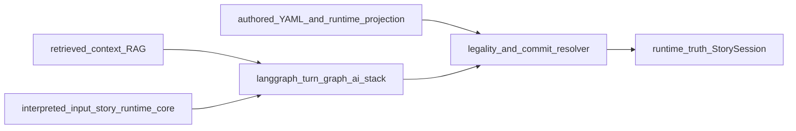

**What to notice.** **Authored** and **projection** define the possibility space; **RAG** is context, not permission to bypass legality; **graph output** feeds **VAL**; only **RT** holds committed `current_scene_id` for the story path.

**Seams:** `commit_models.py`, [`CANONICAL_TURN_CONTRACT_GOC.md`](../../CANONICAL_TURN_CONTRACT_GOC.md).

---

### Diagram 4 — Story session lifecycle (conceptual)

**Title:** High-level story session states.

**What it shows:** Creation, active turns, end—aligned with [`runtime-authority-and-state-flow.md`](runtime-authority-and-state-flow.md).

**Why it matters:** Operators reason about when `execute_turn` applies vs when a session is missing.

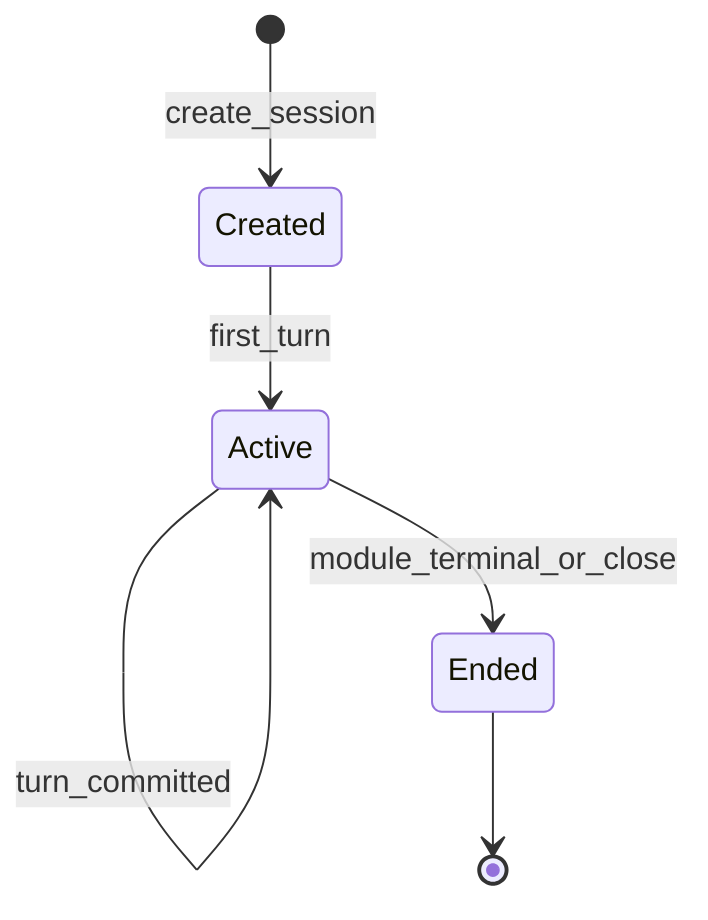

**What to notice.** Exact termination conditions are **module-driven** (`is_terminal`, terminal scenes in projection); handlers live under `world-engine/app/api/http.py` and session usage in backend.

**Seams:** `StoryRuntimeManager.create_session`, `execute_turn`.

---

## Where Live Story State Becomes Real — story runtime in depth (isolation)

### Plain language

Each story session is a small, server-side record: which module, which scene you are in, how many turns ran, and a bounded history of **what the engine accepted** as the narrative commit for each turn.

### Technical precision

- **Session map:** `StoryRuntimeManager.sessions: dict[str, StorySession]` (`world-engine/app/story_runtime/manager.py`).
- **Turn execution:** increments `turn_counter`, runs `turn_graph.run(...)`, computes `narrative_commit`, updates `narrative_threads`, appends to `history` and `diagnostics`, returns a turn envelope including `visible_output_bundle` and graph diagnostics references.
- **Failure handling:** graph exceptions log via `log_story_runtime_failure` (`world-engine/app/observability/audit_log.py`) and re-raise; HTTP layer maps missing session to 404 (`world-engine/app/api/http.py`).

### Why this matters in World of Shadows

This is the **reference implementation** for “models propose; engine commits” for the GoC slice.

### How it connects to adjacent subsystems

Backend stores `world_engine_story_session_id` inside Flask session metadata when proxying (`backend/app/api/v1/session_routes.py`).

### What the World Engine explicitly does not own

Persistent **cross-session player memory** beyond bounded carry-forward fields documented for GoC (e.g. `prior_continuity_impacts` tail in `manager.py`—not a general knowledge base).

**Repository anchors:** `world-engine/app/story_runtime/manager.py`, `world-engine/app/api/http.py`, `world-engine/tests/test_story_runtime_narrative_commit.py`.

---

## How the Engine Meets the Backend — integration and sovereignty

### Plain language

The backend is still the **front door** for many clients, but for live story turns it mostly **forwards** work to the play service and **merges** the response for the UI—without re-executing the same commit logic in Flask.

### Technical precision

- **HTTP client:** `backend/app/services/game_service.py` uses `PLAY_SERVICE_INTERNAL_URL` for internal calls (see `_request` in same module): `POST /api/story/sessions`, `POST .../turns`, `GET .../state`, `GET .../diagnostics`.
- **Auth:** Story routes on the play service require internal API key dependency (`_require_internal_api_key` in `world-engine/app/api/http.py`); backend supplies `X-Play-Service-Key` / `PLAY_SERVICE_INTERNAL_API_KEY` per `world-engine/README.md` and `docker-compose.yml`.
- **Proxy pattern:** `backend/app/api/v1/session_routes.py` `execute_session_turn` loads `world_engine_story_session_id` from session metadata or creates one via `create_story_session` with `compile_module` output, then calls `execute_story_turn_in_engine`.
- **Classification:** Flask in-process `SessionState` and W2 turn paths are **deprecated / volatile** for live authority—see [`backend-runtime-classification.md`](../architecture/backend-runtime-classification.md).

### Why this matters in World of Shadows

Misconfiguring `PLAY_SERVICE_*` surfaces as `GameServiceError` / 502 to the player with `failure_class: world_engine_unreachable` (`session_routes.py`).

### How it connects to adjacent subsystems

Nested **runs** (template lobby path) also use `game_service` (`create_run`, `get_run_details`, `terminate_run`, tickets)—same play service, different API surface.

### What the World Engine explicitly does not own

Backend **user accounts**, **JWT issuance**, and **MCP service token** policy (`require_mcp_service_token` in `backend/app/api/v1/auth.py` for operator reads).

**Repository anchors:** `backend/app/services/game_service.py`, `backend/app/api/v1/session_routes.py`, `docker-compose.yml`.

---

### Diagram 5 — Backend ↔ World Engine (story turn)

**Title:** Request path from Flask to FastAPI story API.

**What it shows:** Lazy binding of backend session to `world_engine_story_session_id`.

**Why it matters:** Shows **handoff** and **sovereignty** (commits occur in `StoryRuntimeManager`, not in Flask).

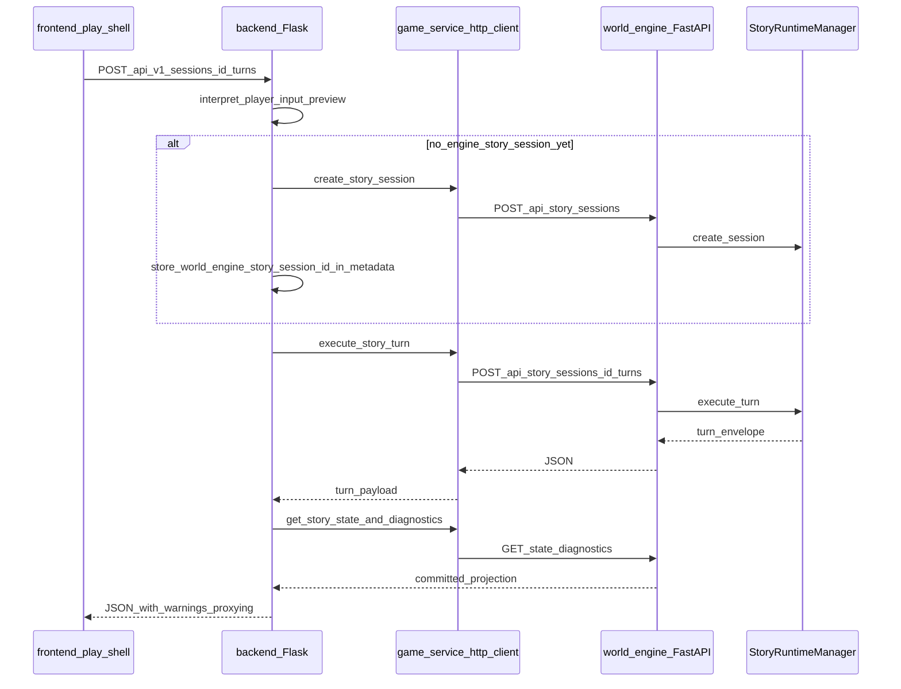

**What to notice.** Warnings in the JSON response flag **proxying** and deprecated local execution (`session_routes.py`).

**Seams:** `backend/app/api/v1/session_routes.py`, `world-engine/app/api/http.py`.

---

## Between Player Intent and System Consequence — player-facing flow

### Plain language

Players type natural language (or explicit commands). That text becomes a **turn**; the UI should show **narration and committed summaries** that match what the engine accepted—not a parallel story invented only in the browser.

### Technical precision

Documented path: [`a1_free_input_primary_runtime_path.md`](a1_free_input_primary_runtime_path.md) — `/play/<run_id>`, `POST /api/v1/sessions`, `POST .../turns`, backend proxies to world-engine, UI reads `turn.visible_output_bundle.gm_narration` and `state.committed_state`.

**Second path (template / real-time):** Backend can issue **WebSocket tickets** (`game_service.issue_play_ticket`) verified by `world-engine/app/auth/tickets.py`; client opens `/ws?ticket=...` and `RuntimeManager.process_command` handles messages (`world-engine/app/api/ws.py`). This path is **not** the same as the story HTTP turn graph.

### Why this matters in World of Shadows

Debugging “stuck scene” for a **play shell** user vs a **WebSocket participant** requires identifying which transport and manager are in use.

### How it connects to adjacent subsystems

Interpretation contract is shared conceptually with `story_runtime_core` ([`player_input_interpretation_contract.md`](player_input_interpretation_contract.md)).

### What the World Engine explicitly does not own

**Rendering policy** in the frontend (typography, layout); the engine supplies **data** for truthful rendering.

**Repository anchors:** [`a1_free_input_primary_runtime_path.md`](a1_free_input_primary_runtime_path.md), `world-engine/app/api/ws.py`, `backend/app/services/game_service.py`.

---

### Diagram 6 — Player flow (story path via backend)

**Title:** From browser input to committed state projection.

**Anchors:** Same as Diagram 5; emphasizes **player** entry.

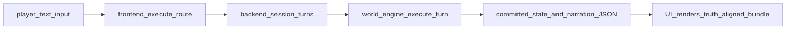

---

### Diagram 7 — Template run path: ticketed WebSocket

**Title:** Run runtime entry separate from story HTTP turns.

**What it shows:** Ticket verification before `RuntimeManager.connect`.

**Why it matters:** Completes the “two faces” picture without overloading the story sequence diagram.

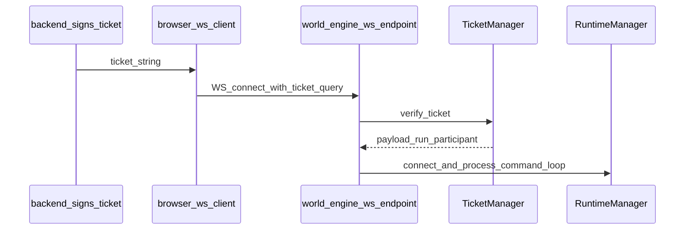

**Seams:** `world-engine/app/api/ws.py`, `world-engine/app/auth/tickets.py`, `game_service.issue_play_ticket`.

---

## The Runtime That AI Cannot Override — AI participation and boundaries

### Plain language

AI can retrieve lore, interpret tone, and propose the next scene—but **the engine** still asks: “Is that transition **legal** for this module projection?”

### Technical precision

- **Orchestration:** `RuntimeTurnGraphExecutor` from `ai_stack` (`world-engine/app/story_runtime/manager.py` imports).
- **Interpretation:** `interpret_player_input` from `story_runtime_core` passed into the executor.
- **Commit boundary:** After `turn_graph.run`, `resolve_narrative_commit` applies legality; model structured `proposed_scene_id` is only a **candidate** ([`world_engine_authoritative_narrative_commit.md`](world_engine_authoritative_narrative_commit.md), [`CANONICAL_TURN_CONTRACT_GOC.md`](../../CANONICAL_TURN_CONTRACT_GOC.md)).

### Why this matters in World of Shadows

Prevents **ungrounded** scene jumps and preserves **auditability** of which candidate source won.

### How it connects to adjacent subsystems

Writers’ Room and improvement flows may share adapters/routing patterns (`ai-stack-overview.md`); they do not grant write access to committed play state.

### What the World Engine explicitly does not own

**Model provider credentials** policy outside its env configuration; **training data** governance; **external LLM account** billing.

**Repository anchors:** `ai_stack/langgraph_runtime.py` (graph definition), `world-engine/app/story_runtime/manager.py`, `story_runtime_core` package root.

---

### Diagram 8 — AI participation sequence (proposal vs commit)

**Title:** Graph execution then engine-side commit resolution.

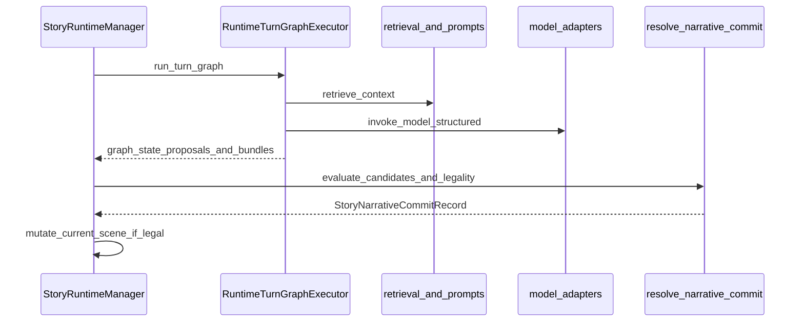

**What to notice.** **RC** is the **final authority** for `committed_scene_id` on this path—not `MD`.

**Seams:** `manager.py` (`execute_turn`), `commit_models.py`.

---

## Why MCP Must Stop at the Control Plane — MCP vs World Engine

### Plain language

MCP tools help operators and developers **inspect** health and content. They are not a secret second game server that can rewrite live sessions without going through the same APIs and keys.

### Technical precision

**Phase A (documented):** MCP server runs locally, talks to **backend** over HTTPS; **not** an in-loop game mechanic ([`01_M0_host_and_runtime.md`](../../mcp/01_M0_host_and_runtime.md)). **Future:** doc mentions possible backend-hosted MCP client phases—**inference** only beyond what is implemented; treat as roadmap language in that file.

**Operator bridge:** Selected backend session snapshot routes require `MCP_SERVICE_TOKEN` ([`backend-runtime-classification.md`](../architecture/backend-runtime-classification.md))—**operator/MCP** surface, distinct from player auth.

### Why this matters in World of Shadows

Avoids **accidental** elevation of debug tools to **runtime authority**.

### How it connects to adjacent subsystems

If MCP triggers backend actions that **call** `game_service`, effects still flow through documented HTTP contracts to `world-engine`—MCP does not embed inside `StoryRuntimeManager`.

### What the World Engine explicitly does not expose

A **public, unauthenticated** MCP tool surface directly on play service ports in the Phase A model.

**Repository anchors:** [`01_M0_host_and_runtime.md`](../../mcp/01_M0_host_and_runtime.md), `tools/mcp_server/` (implementation), `backend/app/api/v1/auth.py` (`require_mcp_service_token`).

---

### Diagram 9 — MCP vs engine authority

**Title:** Control-plane visibility vs runtime host.

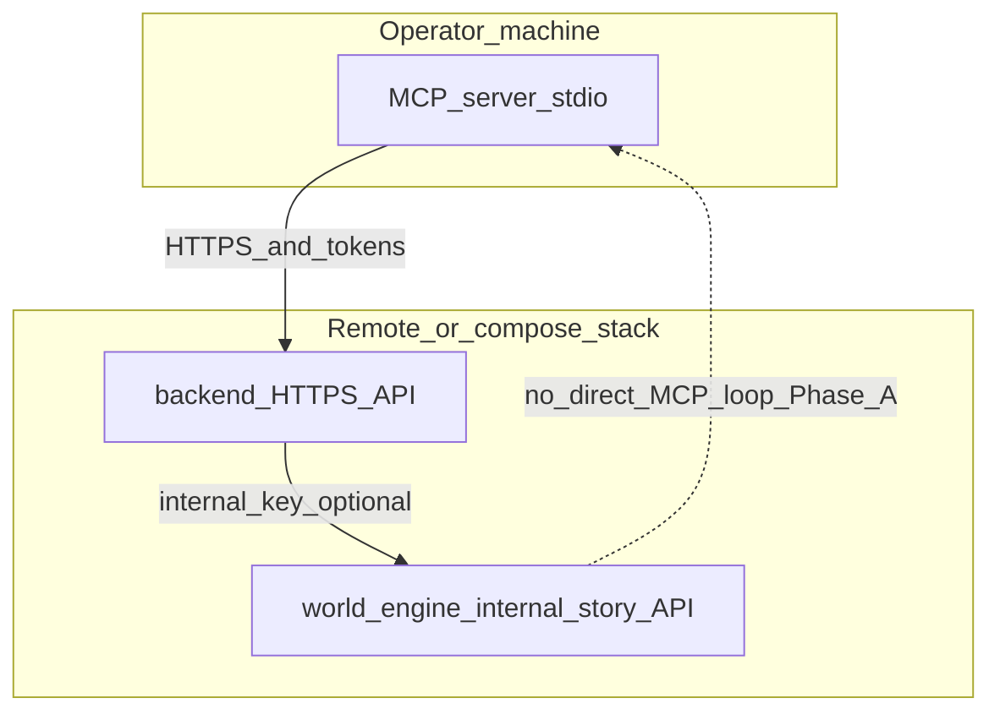

**What to notice.** Dashed line: **no** direct MCP → engine shortcut assumed in M0 decision.

---

## From Authored Material to Committed State — content and Writers’ Room

### Plain language

Stories start as **files** and **review workflows**; the runtime consumes a **compiled, bounded projection** that already reflects governance choices.

### Technical precision

- **Canonical modules:** `content/modules/<module_id>/` (YAML-first).
- **Backend compilation:** `compile_module` used when creating the engine story session from Flask (`session_routes.py`); produces `runtime_projection` payload for `create_story_session`.
- **Published feed:** Play service can pull backend-published templates via `load_published_templates` (`world-engine/app/content/backend_loader.py`) when `BACKEND_API_URL` or `BACKEND_CONTENT_FEED_URL` is set (`world-engine/README.md`); falls back to built-ins (`world-engine/app/content/builtins.py`).
- **Writers’ Room:** Backend APIs under `/api/v1/writers-room/...` ([`how-ai-fits-the-platform.md`](../../start-here/how-ai-fits-the-platform.md)); optional UI in `writers-room/`.

### Why this matters in World of Shadows

Separates **editorial governance** from **session commits**—you can change drafts without mutating an in-flight session unless product policy explicitly does so.

### How it connects to adjacent subsystems

Admin tool uses backend only; engine receives **already published** or **compiled** shapes.

### What the World Engine explicitly does not own

**Work-in-progress draft** semantics inside Writers’ Room databases—unless exposed via feed the engine is configured to read.

**Repository anchors:** `world-engine/app/content/backend_loader.py`, `backend/app/content/compiler/compiler.py` (via `app.content.compiler` in `session_routes.py`), `content/modules/`.

---

### Diagram 10 — Writers’ Room / authored content → runtime

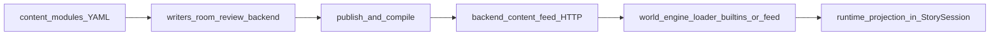

**Seams:** `backend_loader.py`, `session_routes.py` (`compile_module`).

---

## Diagnostics, observability, and operations

### Plain language

When something goes wrong in a turn, engineers need **two levels**: rich internal traces for debugging, and a **trimmed** view that matches what the player session “officially” is.

### Technical precision

- **HTTP:** `GET /api/story/sessions/{id}/state` and `/diagnostics` (`world-engine/app/api/http.py`); semantics in [`world_engine_authoritative_narrative_commit.md`](world_engine_authoritative_narrative_commit.md) (`committed_state`, `authoritative_history_tail`).
- **Logging:** `log_story_turn_event`, `log_story_runtime_failure` (`world-engine/app/observability/audit_log.py`); trace middleware (`world-engine/app/middleware/trace_middleware.py`).
- **Bridge logging:** `log_world_engine_bridge` in backend when proxying (`session_routes.py` imports).

### Why this matters in World of Shadows

Supports **trust**: operators can correlate a player-visible commit with graph errors without leaking full blobs into every history row.

### How it connects to adjacent subsystems

CI and contract tests (`world-engine/tests/test_story_runtime_*.py`, [`WORLD_ENGINE_TARGET_TEST_MATRIX.md`](../../testing/WORLD_ENGINE_TARGET_TEST_MATRIX.md)) guard regressions in diagnostics shape.

### What the World Engine explicitly does not guarantee

**Long-term cold storage** of every diagnostic envelope in external analytics—retention policies are deployment-specific (**inference**).

**Repository anchors:** `world-engine/app/observability/audit_log.py`, `world-engine/app/middleware/trace_middleware.py`, [`world_engine_authoritative_narrative_commit.md`](world_engine_authoritative_narrative_commit.md).

---

### Diagram 11 — Observability: diagnostics vs committed tail

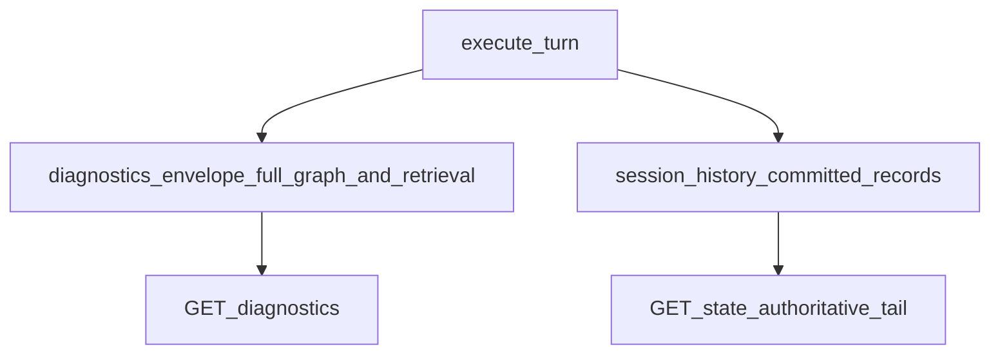

**Seams:** `StoryRuntimeManager.execute_turn` (append to `diagnostics` and `history`), `get_state` / `get_diagnostics` in `manager.py`.

---

### Diagram 12 — Deployment topology (local compose)

**Title:** Services from root `docker-compose.yml`.

**What it shows:** Ports and `PLAY_SERVICE_*` wiring.

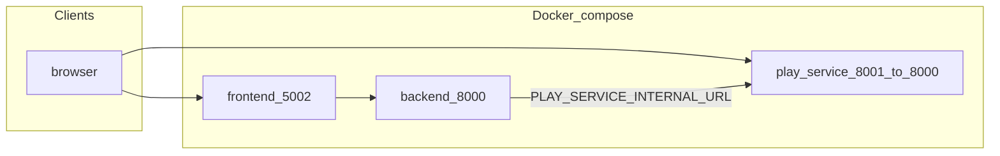

**What to notice.** Frontend `PLAY_SERVICE_PUBLIC_URL` may point at **localhost:8001** for browser-visible play URLs while backend uses **internal** service DNS `play-service:8000`.

**Seams:** [`docker-compose.yml`](../../../docker-compose.yml).

---

## The full system interaction picture

**Plain language.** One hub (**world-engine**) receives **compiled story projections** and **player text**, runs **AI-assisted interpretation**, and **commits** legal state; **backend** sits in front for auth and integration; **MCP** helps operators **see** the system without becoming the runtime.

**Technical precision.** Combine Diagrams 1, 5, 6, 8, 10, and 9: context → content compile → proxy turn → graph → commit → diagnostics; add Diagrams 7 and 12 when debugging transport/topology; MCP and admin stay on backend edges.

**Why this matters.** On-call runbooks should start from **which face** (run vs story) and **which transport** (HTTP internal vs WebSocket).

**Adjacent systems.** See [System map — services and data stores](../../start-here/system-map-services-and-data-stores.md) if present in your checkout.

**Not owned.** End-to-end **product analytics** funnels outside logging hooks.

**Repository anchors:** `world-engine/app/main.py`, `backend/app/services/game_service.py`, [`architecture-overview.md`](../architecture/architecture-overview.md).

---

## Open seams, transitional areas, and future growth

**Transitional (documented elsewhere, not invented here).**

- Flask **in-process** `SessionState` and related W2 turn machinery remain for tests, MCP, and operator snapshots but are **explicitly not** authoritative live play ([`backend-runtime-classification.md`](../architecture/backend-runtime-classification.md)).
- Backend session proxy carries **warnings** in JSON to prevent mistaking Flask memory for engine truth (`session_routes.py`).
- MCP **Phase B/C** language in [`01_M0_host_and_runtime.md`](../../mcp/01_M0_host_and_runtime.md) describes **possible** futures—treat as non-binding until implemented.

**Growth pattern (inference).** Split follow-on pages as in the original authoring prompt: engine/backend contract, session lifecycle deep dive, MCP boundary hardening, observability retention—each linking back to **this** spine.

**Repository anchors:** [`backend-runtime-classification.md`](../architecture/backend-runtime-classification.md), [`01_M0_host_and_runtime.md`](../../mcp/01_M0_host_and_runtime.md), `backend/app/api/v1/session_routes.py`.

---

## Conclusion

The **World Engine** (`world-engine/`) is the **authoritative FastAPI play host** for **template runs** and **story sessions**. Its deepest **commit semantics** are explicit in the **story runtime** (`StoryRuntimeManager` + `resolve_narrative_commit`). The **backend** integrates via **`game_service`** and must not silently re-host the same authority inside Flask. **AI** runs **around** those commit seams, not **instead** of them. **MCP** remains **control-plane adjacent** in Phase A. Use this document as the **canonical entry**; drill into linked contracts and tests when changing behavior.

**Verification-oriented tests (non-exhaustive):** `world-engine/tests/test_backend_bridge_contract.py`, `world-engine/tests/test_story_runtime_narrative_commit.py`, `backend/tests/test_session_api_contracts.py`.

---

## Related navigation

| Audience | Next read |
|----------|-----------|
| New to the platform | [`what-is-world-of-shadows.md`](../../start-here/what-is-world-of-shadows.md) |
| Implementing AI | [`ai-stack-overview.md`](../ai/ai-stack-overview.md), [`VERTICAL_SLICE_CONTRACT_GOC.md`](../../VERTICAL_SLICE_CONTRACT_GOC.md) |
| Writing tests | [`WORLD_ENGINE_TARGET_TEST_MATRIX.md`](../../testing/WORLD_ENGINE_TARGET_TEST_MATRIX.md) |
